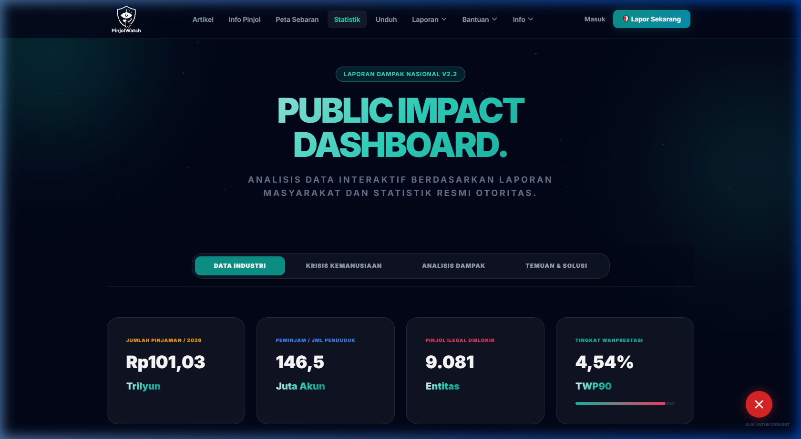

# PinjolWatch



PinjolWatch is an independent, community-driven platform designed to provide a secure and anonymous reporting mechanism for victims of illegal online lending platforms (Pinjol) in Indonesia. The application is built with a strong emphasis on user privacy, modern UI/UX design, and open-source intelligence gathering.

## Project Overview

The primary objective of PinjolWatch is to map, report, and provide psychological mitigation for victims of aggressive debt collection practices. By aggregating anonymous reports, the platform aims to generate data-driven insights that can assist local authorities and financial regulators in cracking down on illegal financial operations.

## Core Features

- **Anonymous Reporting System**
  Victims can submit detailed reports regarding debt collector intimidation tactics without revealing their personal identity. The system utilizes unique tracking tickets instead of traditional user accounts.

- **Threat Intelligence & OSINT Tracking**
  The platform records detailed aggressive behaviors, such as illegal data distribution, contact harassment, and psychological threats, enabling pattern recognition across different illegal lending syndicates.

- **Automated Verification Services**
  - **OJK Integration**: Features a localized weekly synchronization service that fetches the official list of licensed financial technology companies from the Otoritas Jasa Keuangan (OJK) Open Data portal.
  - **Bank Indonesia API**: Integrates real-time baseline interest rates to provide comparative financial literacy and empirical evidence against predatory lending rates.

- **Mobile-First Architecture**
  Engineered with a dedicated mobile-specific layout that employs User-Agent sniffing to deliver an app-like experience (including bottom navigation) for mobile users while preserving a rich, expansive desktop view.

- **Mental Health Assessment**
  Incorporates a standardized psychological questionnaire (K10 scale) to measure the psychological impact and distress levels of the victims, providing immediate guidance for recovery.

## Technology Stack

- **Framework**: Laravel 12.x
- **Frontend**: Livewire 3.x, Alpine.js, Tailwind CSS
- **Database**: MySQL
- **User-Agent Parsing**: Jenssegers Agent

## Installation and Setup

### Prerequisites

- PHP 8.2 or higher
- Composer
- Node.js & NPM
- MySQL Database

### Installation Steps

1. **Clone the Repository**
   ```bash
   git clone https://github.com/diskonnekted/pinjolwatch.git
   cd pinjolwatch
   ```

2. **Install Dependencies**
   ```bash
   composer install
   npm install
   npm run build
   ```

3. **Environment Configuration**
   ```bash
   cp .env.example .env
   php artisan key:generate
   ```
   Update the `.env` file with your database credentials.

4. **Database Migration and Seeding**
   ```bash
   php artisan migrate --seed
   ```

5. **Start the Development Server**
   ```bash
   php artisan serve
   ```

## Scheduled Tasks

To ensure the local database remains up to date with the latest official fintech registry, ensure the Laravel scheduler is running. This handles the automated synchronization with the OJK Open Data portal.

```bash
php artisan schedule:work
```

## Contributing

Contributions are welcome. Please ensure that your pull requests adhere to the PSR-12 coding standard and that no sensitive victim data is compromised in your testing environments.

## License

This project is proprietary and intended solely for the use of independent tracking and public service reporting. All rights reserved.
